<picture>
  <source media="(prefers-color-scheme: dark)" srcset="docs/assets/banner-dark.svg">
  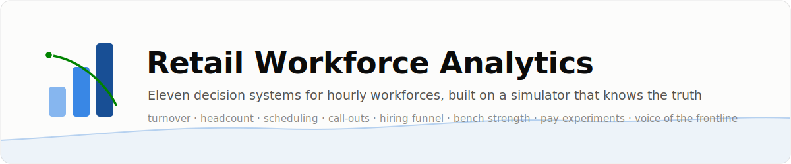
</picture>

<p align="center">
  <a href="https://github.com/immu4989/retail-workforce-analytics/actions/workflows/ci.yml"></a>
  
  
  
  
</p>

<p align="center">
  <a href="#the-eighteen-use-cases">Use cases</a> ·
  <a href="#see-it-work">Results</a> ·
  <a href="#what-it-is-worth-in-dollars">Dollars</a> ·
  <a href="#quickstart">Quickstart</a> ·
  <a href="docs/ROADMAP.md">Roadmap</a>
</p>

> 🤖 **Agentic-AI versions of workforce problems** — LLM agents with verified evals,
> cost-per-run in dollars, and observed failure modes — are being built in
> [awesome-agentic-usecases](https://github.com/immu4989/awesome-agentic-usecases),
> where this repo's simulator seeds the retail-workforce vertical.

I spent years building these systems for one of the largest retail
workforces in the world. Real HR data can never be shared, so this repo does
the next best thing: it ships a workforce simulator with a **documented
ground-truth hazard model** and builds the full modelling stack on top of it.
Every claim about "what drives turnover" or "what a raise buys" can be
checked against the process that generated the data — something no project
built on real HR data, and no static demo dataset, can offer.

<picture>
  <source media="(prefers-color-scheme: dark)" srcset="docs/assets/stats-dark.svg">
  
</picture>

> [!TIP]
> **The oracle ceiling is the repo's signature move.** Because the simulator's
> hazard coefficients are published, you can score the *true* risk model and
> measure the best AUC any model could reach. Turnover turns out to be a
> low-signal problem: the ceiling is ~0.67, and the models here capture
> **92-99% of it**. On real data you never know if 0.67 is a weak model or a
> hard problem. Here it is a unit test.

## How it fits together

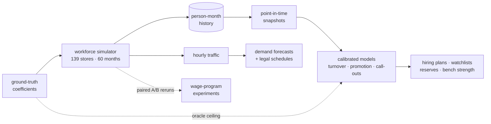

## The eighteen use cases

| # | | Use case | Writeup |
|---|---|----------|---------|
| 1 | 🚪 | Hourly turnover risk (baristas, shift supervisors) at 3/6/12 months | [docs](docs/use_cases/01_hourly_turnover.md) |
| 2 | 👔 | Salaried turnover risk (store managers, assistants) at 6/12 months | [docs](docs/use_cases/02_salaried_turnover.md) |
| 3 | 🧮 | Headcount forecasting: "hire N baristas in district D this quarter" | [docs](docs/use_cases/03_headcount_forecasting.md) |
| 4 | 🎛️ | Turnover drivers, SHAP reason codes, what-if interventions | [docs](docs/use_cases/04_turnover_drivers.md) |
| 5 | 📅 | Demand-driven labor forecasting + fair-workweek scheduling | [docs](docs/use_cases/05_demand_scheduling.md) |
| 6 | 🤒 | Call-out (unplanned absence) prediction + reserve staffing | [docs](docs/use_cases/06_absenteeism.md) |
| 7 | 🧲 | Hiring funnel analytics + requisition timing | [docs](docs/use_cases/07_hiring_funnel.md) |
| 8 | 🪜 | Promotion readiness + leadership bench strength | [docs](docs/use_cases/08_internal_mobility.md) |
| 9 | 🧪 | Turnover contagion, and why the naive estimate misleads | [docs](docs/use_cases/09_turnover_contagion.md) |
| 10 | 💵 | Compensation: raises, floors and freezes priced by true experiments | [docs](docs/use_cases/10_compensation.md) |
| 11 | 🎧 | Employee call-center topic mining (voice of the frontline) | [docs](docs/use_cases/11_call_center_topics.md) |
| 12 | 📈 | Staffing-to-sales elasticity: derive the cost of an understaffed hour | [docs](docs/use_cases/12_staffing_elasticity.md) |
| 13 | 🕵️ | Overtime & labor-cost anomaly detection (time theft, ghost shifts, buddy punching) | [docs](docs/use_cases/13_labor_anomaly.md) |
| 14 | 🌱 | First-90-day onboarding risk + new-hire watchlist (30/60/90 milestones) | [docs](docs/use_cases/14_onboarding.md) |
| 15 | 🗣️ | Exit-interview NLP: themes tied to true drivers, recovered unsupervised | [docs](docs/use_cases/15_exit_nlp.md) |
| 16 | 🍔 | Task-level labor standards from order mix (front counter / drive-thru / mobile / delivery) | [docs](docs/use_cases/16_task_standards.md) |
| 17 | ⚖️ | Pay-equity audit, and validating the audit's power and false-positive rate | [docs](docs/use_cases/17_pay_equity.md) |
| 18 | 🗺️ | Geographic transfer matching: move far commuters to closer vacancies (Hungarian) | [docs](docs/use_cases/18_geo_transfers.md) |

Use cases 1-4 and 14 are the people stack, 5-9 and 12-13 and 16 and 18 the
operations stack, 10-11 and 15 compensation and voice of the frontline, 17
governance — one runnable pipeline each (see [Quickstart](#quickstart)). Every
use case on the original roadmap has now been built; what a next round could add
is in [docs/ROADMAP.md](docs/ROADMAP.md).

## See it work

**Models against the best possible model.** Out-of-time AUC per horizon,
with the oracle ceiling drawn on top — and calibration tight enough
(ECE 1-4%) to sum probabilities into hiring plans:

<table>
  <tr>
    <td width="50%">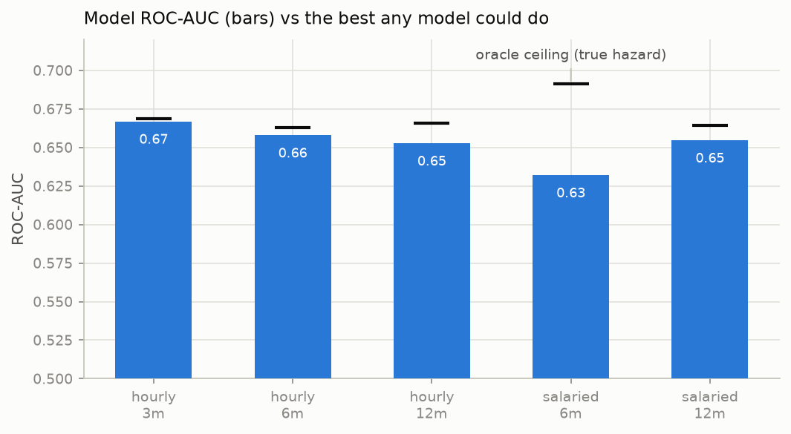</td>
    <td width="50%">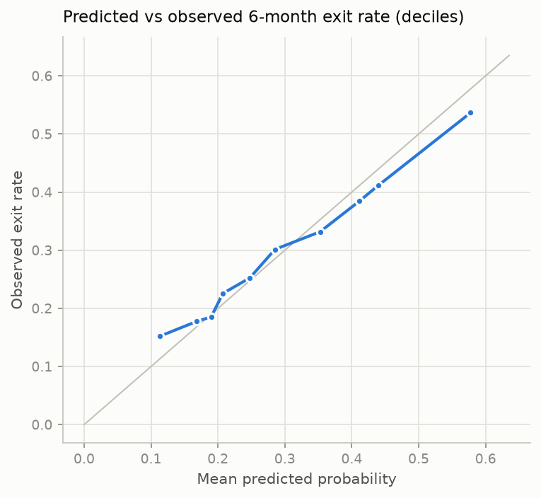</td>
  </tr>
</table>

**A true experiment on pay.** Use case 10 doesn't stop at what-if rescoring:
it reruns the *world* with and without a wage program on paired seeds. The
two arms are the same company — same people, same shocks — until the policy
lands:

<table>
  <tr>
    <td width="50%">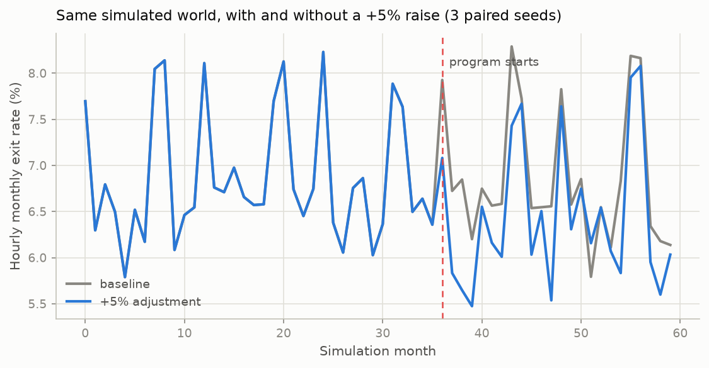</td>
    <td width="50%">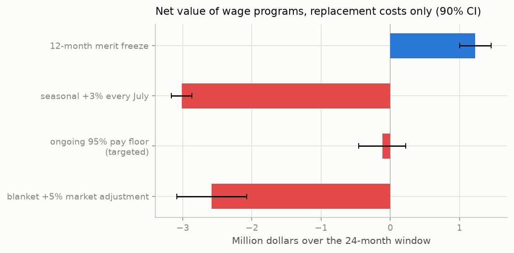</td>
  </tr>
</table>

**A methods lesson no real dataset can teach.** The simulator plants **no**
turnover contagion, yet the raw data reproduces the +19% "contagious
turnover" effect from the literature. Stratify on store conditions and it
vanishes — the naive estimate was confounding, and here that is provable:

<table>
  <tr>
    <td width="50%">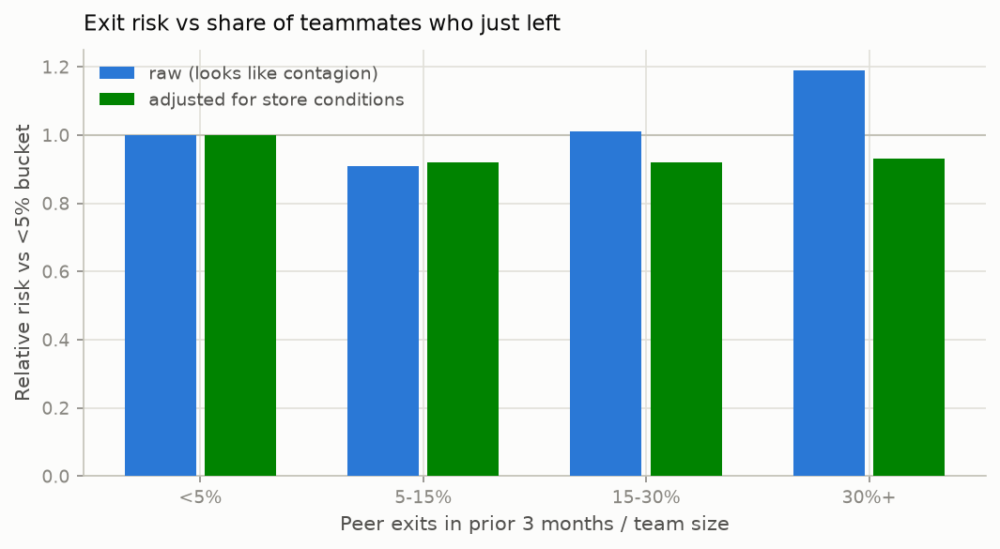</td>
    <td width="50%">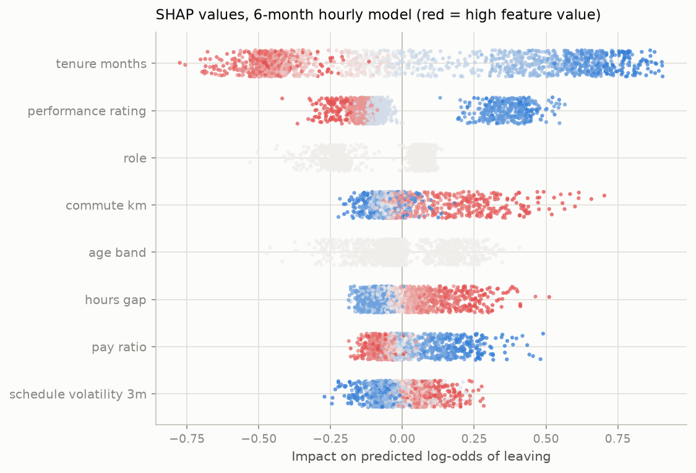</td>
  </tr>
</table>

**The frontline tells you what is broken, if you listen.** An unsupervised
topic model recovers the planted call-center topics (NMI 0.88), and call
volumes carry operational signal — stores that call about scheduling are
the stores with chaotic schedules (r = 0.71):

<table>
  <tr>
    <td width="50%">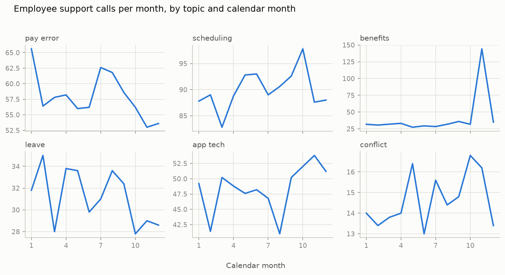</td>
    <td width="50%">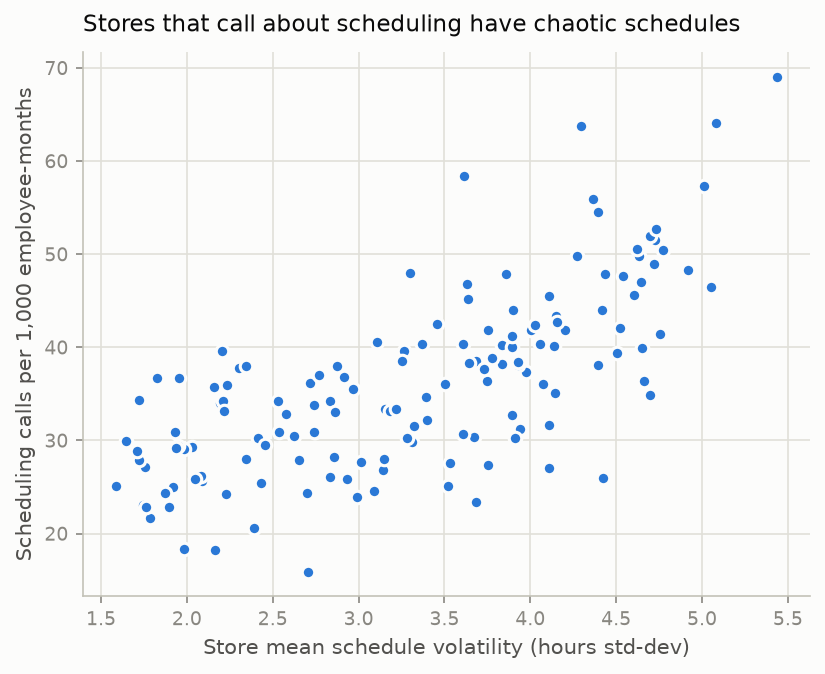</td>
  </tr>
</table>

<details>
<summary><b>📊 Full figure gallery</b> (9 more: demand forecasts, hiring plans, survival curves, funnel, drivers...)</summary>
<br>
<table>
  <tr>
    <td width="50%">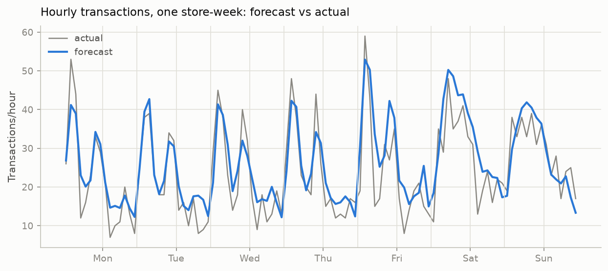</td>
    <td width="50%">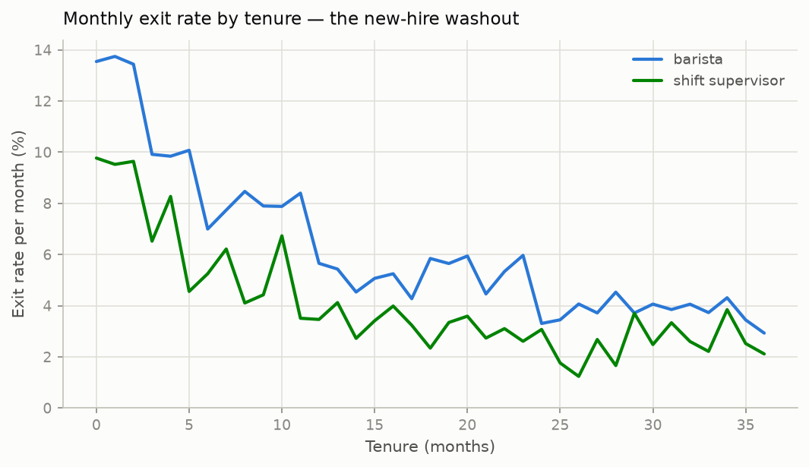</td>
  </tr>
  <tr>
    <td width="50%">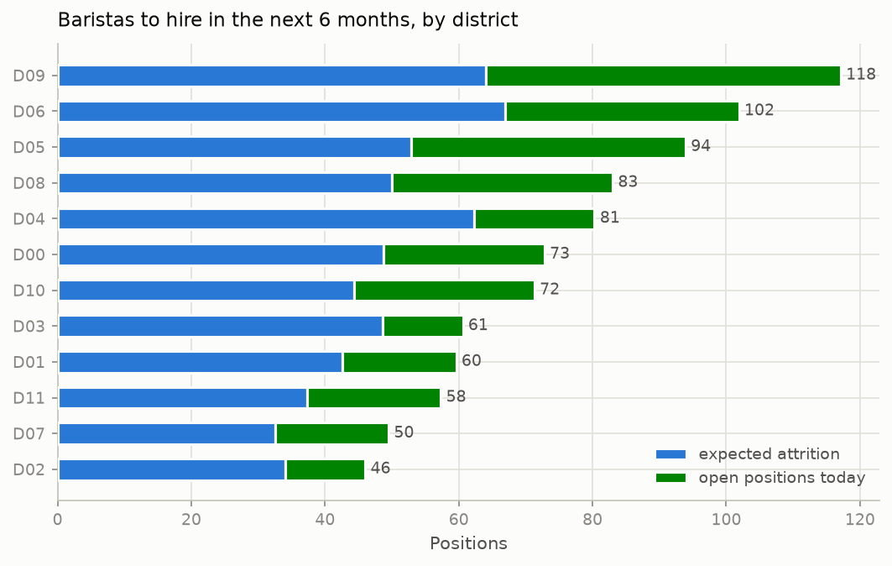</td>
    <td width="50%">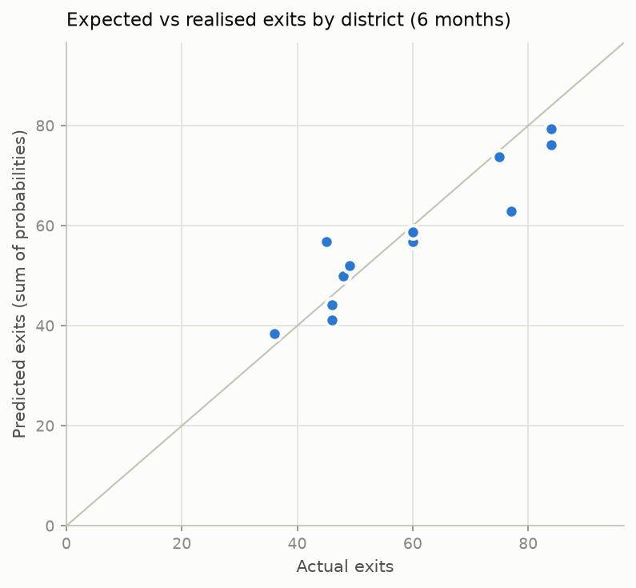</td>
  </tr>
  <tr>
    <td width="50%">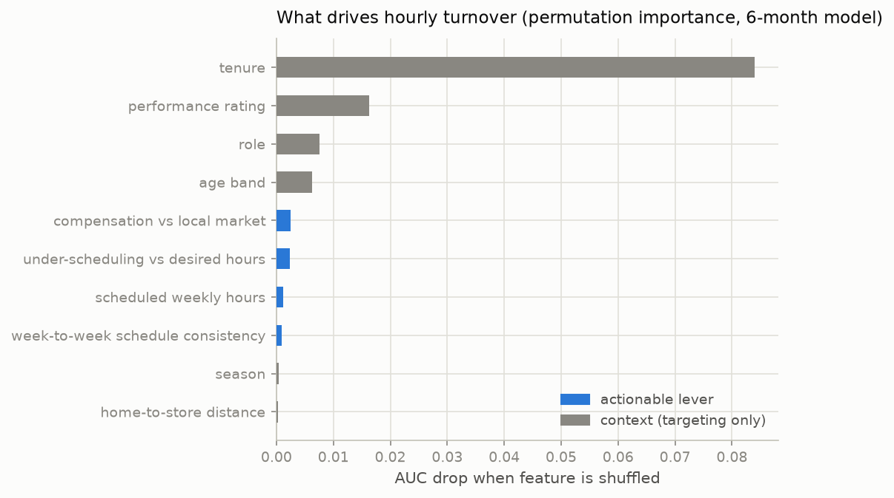</td>
    <td width="50%">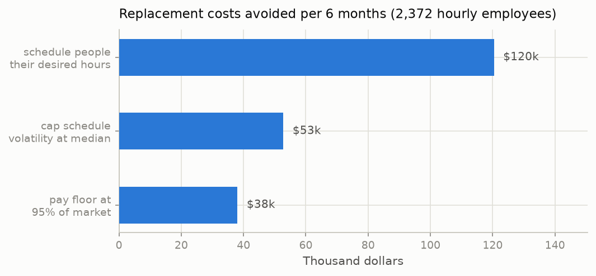</td>
  </tr>
  <tr>
    <td width="50%">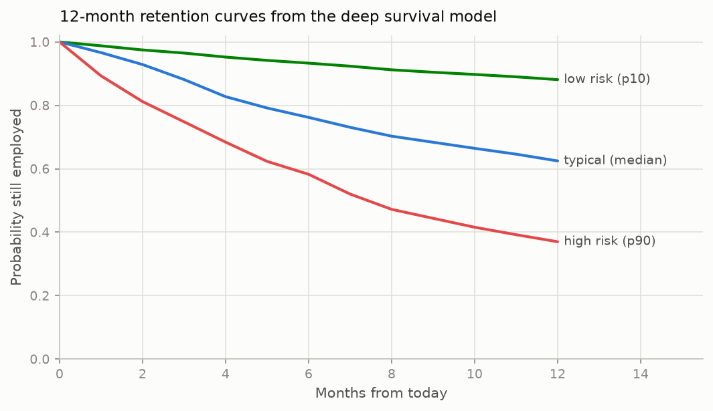</td>
    <td width="50%">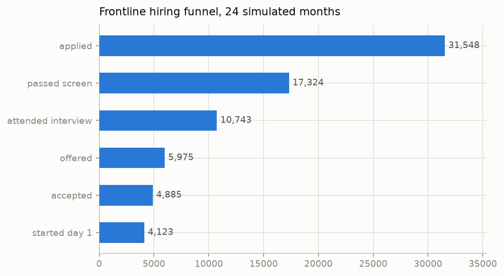</td>
  </tr>
  <tr>
    <td width="50%">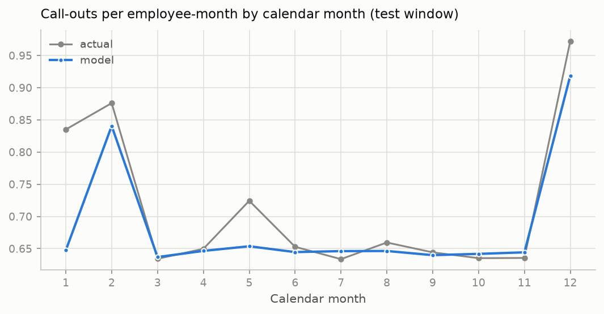</td>
    <td width="50%"></td>
  </tr>
</table>
</details>

## What it is worth in dollars

Every number is computed under stated, adjustable assumptions (`CostModel`),
on the simulated ~2,900-person company. The per-use-case writeups show the
arithmetic and how it scales with workforce size.

| Question | Answer |
|----------|--------|
| Baseline attrition burn | **$12.9M per year** (2,126 exits, mostly baristas) |
| Demand-driven scheduling vs staff-to-average | **$328 per store-week**, $2.4M/yr chain-wide |
| Best single retention lever found | Scheduling people their desired hours: $240k/yr |
| Targeted retention program (top decile) | **1.76x ROI** vs 1.03x untargeted |
| Targeted 95% pay floor vs blanket +5% raise | **~2.5x more retention per wage dollar** |
| Headcount plan accuracy | 699 predicted vs 710 actual exits over 6 months |
| Merit freeze | "saves" $1.2M on replacement-cost accounting — the trap use case 10 dissects |

> [!IMPORTANT]
> These are exact computations on synthetic data, not promises. Swap in your
> own replacement costs and wage assumptions before quoting any of it
> internally — every parameter is explicit, and the writeups flag what each
> ledger deliberately leaves out.

## What makes this different from the usual attrition demo

Most public attrition projects train a classifier on a static cross-section
and report an inflated AUC. Turnover does not work like that in production.

- **Point-in-time snapshots.** One row per employee per month, features as
  they were known that month, labels from the future window. No leakage;
  there is a test asserting it.
- **Out-of-time evaluation.** Train on early months, test on later months —
  what scoring next quarter actually looks like. Random row splits memorise
  employee identity and overstate everything.
- **Calibrated probabilities.** Isotonic calibration on a later window, so
  probabilities sum into expected headcount losses. That is what turns a
  risk score into a hiring plan.
- **A known answer key.** `ground_truth.json` ships with every dataset;
  driver recovery, SHAP direction, and the oracle ceiling are all tested
  against it.

A deep discrete-time survival network (`SurvivalNN`, PyTorch, optional)
matches the gradient-boosted models on ranking from a single trained
artifact and produces full 12-month retention curves; the GBM stays the
recommended default, and the honest comparison ships in
`reports/nn_vs_gbm_hourly.csv`.

<details>
<summary><b>📈 Headline metrics table</b> (out-of-time test window)</summary>
<br>

| Population | Horizon | Base rate | ROC-AUC | Ceiling | Calibration (ECE) | Lift @ top decile |
|------------|---------|-----------|---------|---------|-------------------|-------------------|
| Hourly | 3 mo | 0.17 | 0.667 | 0.668 | 0.009 | 2.1x |
| Hourly | 6 mo | 0.29 | 0.658 | 0.663 | 0.022 | 1.8x |
| Hourly | 12 mo | 0.45 | 0.653 | 0.666 | 0.045 | 1.6x |
| Salaried | 6 mo | 0.11 | 0.632 | 0.691 | 0.038 | 1.9x |
| Salaried | 12 mo | 0.21 | 0.655 | 0.664 | 0.065 | 2.4x |

Plus: demand forecast WAPE 17.8% vs 24.1% seasonal-naive · schedule
stability 94% week-over-week with zero legal violations · promotion
readiness AUC 0.845 · call-topic recovery NMI 0.88 · pay elasticity
estimates bracket the true coefficient.
</details>

## Quickstart

```bash
git clone https://github.com/immu4989/retail-workforce-analytics
cd retail-workforce-analytics
pip install -e ".[dev]"

python examples/run_pipeline.py        # 1-4: turnover, headcount, drivers      (~2 min)
python examples/run_operations.py      # 5-9: scheduling, call-outs, funnel     (~3 min)
python examples/run_comp_and_voice.py  # 10-11: wage experiments, call topics   (~4 min)
python examples/run_real_data_audit.py # audit an extract for leakage before you model (~30 s)
python examples/run_labor_anomaly.py   # 13: detect time theft, ghost shifts, buddy punching (~40 s)
python examples/run_onboarding.py      # 14: first-90-day washout model + new-hire watchlist (~30 s)
python examples/run_exit_nlp.py        # 15: recover exit reasons, aligned to true drivers (~30 s)
python examples/run_task_standards.py  # 16: task-time labor standards vs the flat 18/hr rate (~40 s)
python examples/run_pay_equity.py      # 17: pay-gap audit + power/false-positive validation (~40 s)
python examples/run_geo_transfers.py   # 18: match far commuters to closer vacancies (~30 s)
```

Everything lands in `reports/` (CSV/JSON) and `docs/figures/` (PNG).
Optional extras: `".[explain]"` for SHAP, `".[deep]"` for the survival
network.

<details>
<summary><b>🐍 Python quick tour</b></summary>

```python
from workforce_analytics import (
    SimulationConfig, generate, build_snapshots, time_split,
    TurnoverModel, evaluate_with_ceiling, build_hiring_plan,
    InterventionSimulator, stabilize_schedules, CostModel,
)

# 1. Simulate a company (or load your own HRIS extract in the same shape).
result = generate(SimulationConfig())

# 2. Point-in-time snapshots with 3/6/12-month labels.
snaps = build_snapshots(result.person_months, horizons=(3, 6, 12))
train, val, test = time_split(snaps, train_end=36, val_end=44)

# 3. Calibrated multi-horizon turnover model, scored against the ceiling.
model = TurnoverModel("hourly").fit(train, val)
print(evaluate_with_ceiling(model, test))

# 4. "How many baristas does each district need to hire this half?"
preds = model.predict(snaps[snaps["month"] == 48])
plan = build_hiring_plan(preds, result.stores, horizon=6)

# 5. "What would stabilising schedules buy us, in dollars?"
sim = InterventionSimulator(model, snaps[snaps["month"] == 48])
print(sim.run(stabilize_schedules(), "cap schedule volatility", horizon=6,
              cost_model=CostModel()))

# 6. "Why is this employee at risk?" (shap extra)
from workforce_analytics import reason_codes
print(reason_codes(model, snaps[snaps["month"] == 48], horizon=6).head())

# 7. A true experiment on pay (reruns the simulator, paired seeds).
from workforce_analytics import WageProgram, run_wage_experiment
floor = WageProgram("95% pay floor", kind="floor", floor_ratio=0.95, start_month=36)
print(run_wage_experiment(floor, seeds=(0, 1, 2)))
```
</details>

<details>
<summary><b>🗂 Repository layout</b></summary>

```
src/workforce_analytics/
    config.py       simulation settings + the ground-truth hazard coefficients
    generator.py    month-by-month workforce simulator (hiring, promotion, attrition)
    snapshots.py    point-in-time feature/label construction, out-of-time splits
    turnover.py     calibrated multi-horizon gradient-boosted turnover models
    survival_nn.py  deep discrete-time survival model (optional, torch)
    evaluation.py   discrimination, calibration and lift metrics
    oracle.py       the oracle ceiling: how well could a perfect model do?
    headcount.py    hiring plans from expected attrition + growth + vacancies
    drivers.py      permutation importance, PDPs, what-if intervention simulator
    explain.py      SHAP: global importance + per-employee reason codes (optional, shap)
    cost_model.py   dollars: baseline burn, intervention value, targeting ROI
    demand.py       hourly traffic simulator, labor forecaster, fair-workweek scheduler
    absence.py      call-out simulator, Poisson prediction, reserve staffing
    funnel.py       hiring funnel simulator, stage conversion, requisition timing
    mobility.py     promotion events, readiness model, bench strength
    contagion.py    peer-exit exposure analysis, raw vs stratified
    compensation.py pay elasticity, wage-program experiments (raise/floor/freeze)
    callcenter.py   synthetic transcripts with hidden topics, NMF topic model
    elasticity.py   service-loss mechanism: derive the cost of an understaffed hour
    exitnlp.py      exit-comment themes tied to hazard drivers, NMF recovery + alignment
    geo.py          geographic transfer matching: far commuters to closer vacancies
    onboarding.py   first-90-day washout model, 30/60/90 milestones, new-hire watchlist
    payequity.py    residual pay-gap audit + power/false-positive validation
    punchclock.py   payroll-anomaly detection: time theft, ghost shifts, buddy punching
    realdata.py     HRIS-extract audit: contract validator + leakage linters
    tasks.py        task-level labor standards from order mix vs the flat rate
examples/           ten scripts (people, operations, comp & voice, real-data audit, labor
                    anomaly, onboarding, exit NLP, task standards, pay equity, geo transfers)
tests/              107 tests: realism, leakage, calibration, SHAP additivity, accounting
docs/               per-use-case writeups, roadmap, guide to adapting real HRIS data
```
</details>

## Using this with real data

Shape your HRIS extract like `person_months` (one row per employee per
month; the full contract is in
[docs/adapting_to_real_data.md](docs/adapting_to_real_data.md)) and
everything downstream of the generator works unchanged. Before you model,
**audit the extract** — the data mistakes that sink these projects are silent
and produce a confident, wrong model:

```python
from workforce_analytics import validate_person_months, audit_split

report = validate_person_months(your_person_months)
print(report.summary())        # contract errors + leakage warnings, with row counts
report.raise_if_errors()       # stop the pipeline on hard violations
```

`validate_person_months` checks the contract (schema, one spell per employee,
contiguous months, no rows after termination) and runs leakage linters for
the failure modes that manufacture a fake AUC: **backfilled ratings** (the
HRIS stamping today's rating onto history), **termination-row pay spikes**
(severance and PTO payouts corrupting exit-pay analytics), and **in-notice
hours collapse** (employees taken off the schedule before they leave, which
lets a model predict paperwork instead of risk). `audit_split` catches the
random-split mistake on an already-built snapshot table.

Every linter is calibrated and validated against *planted* bugs, the same
oracle trick the models use — `make_messy_extract` injects each documented
mistake into clean simulator output with a per-employee log, so recall and
false-positive rate are measured, not asserted. Run the whole demonstration,
including how much each bug inflates the numbers if it slips through:

```bash
python examples/run_real_data_audit.py
```

Two cautions still matter more than any modelling choice: keep features
point-in-time, and treat driver analysis as hypothesis generation until a
lever has been validated with an experiment.

The same document covers the ethical guardrails: aggregate before sharing,
no protected attributes as features, retention actions that are
positive-sum, and the regulatory context for automated employment decisions.
No real employee data was used anywhere in this project; simulator
parameters were set from public retail benchmarks.

## License

MIT. If this repo is useful to you, a ⭐ helps other people find it.
